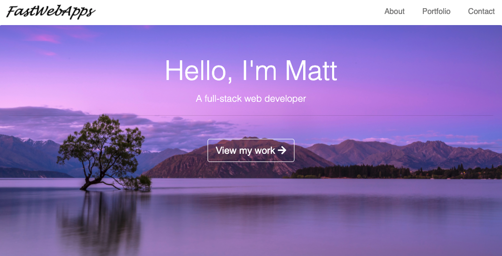

# Portfolio site
> My Portfolio page

## Table of contents
* [General info](#general-info)
* [Screenshots](#screenshots)
* [Technologies](#technologies)
* [Setup](#setup)
* [Features](#features)
* [Status](#status)
* [Contact](#contact)

## General info
This is my portfolio page. It will be continuously updated as new projects are created.

## Screenshots

## Technologies
* HTML 5
* CSS 3
* JavaScript (ES 2018)

## Setup 
[View the site here](https://mworsfold15.github.io/Portfolio)

## Features
* Dark Mode
* CSS flexbox
* Responsive images and text when browser is collapsed

## Status
Project is: _finished_

## Contact
Created by [Matt Worsfold](https://www.linkedin.com/in/matt-worsfold-042698151/)